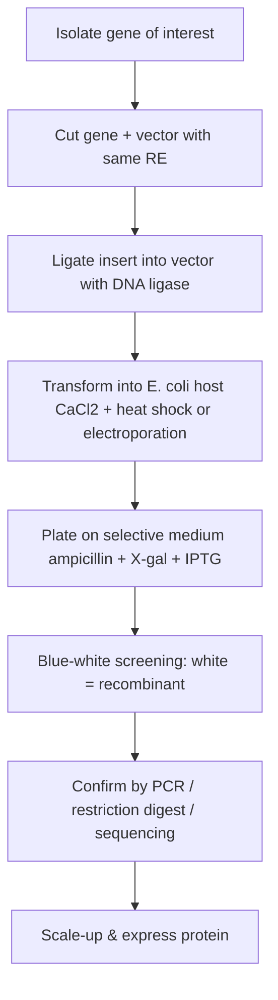
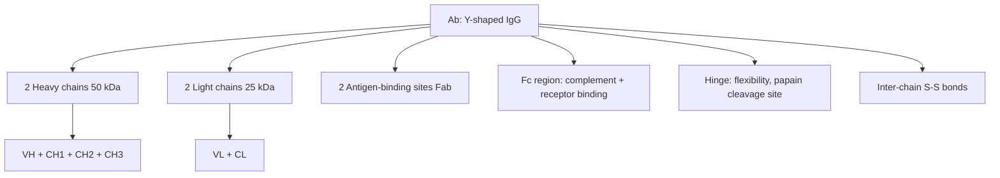
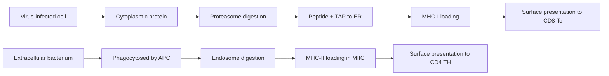
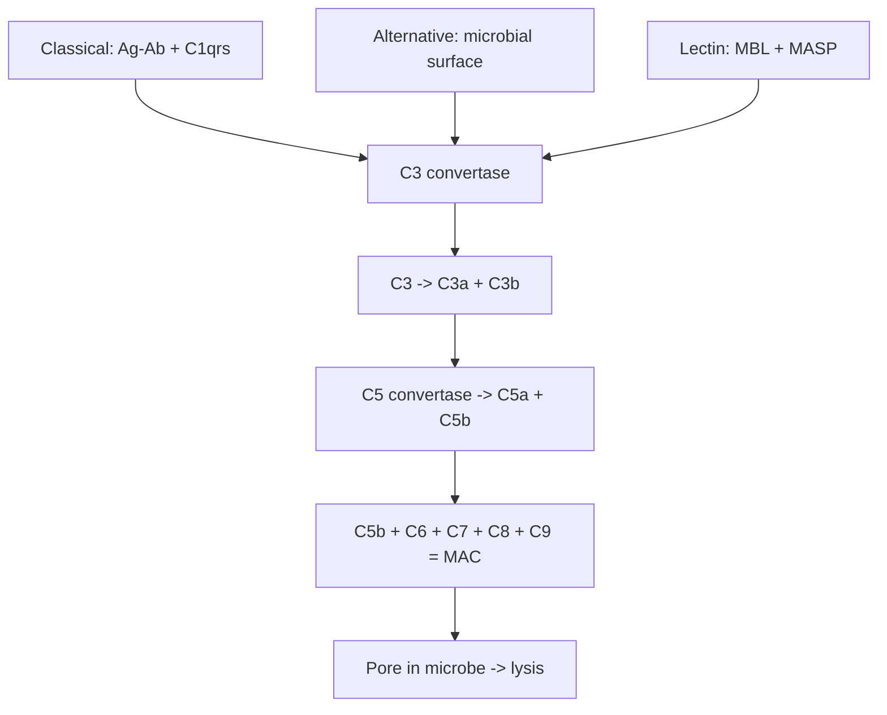
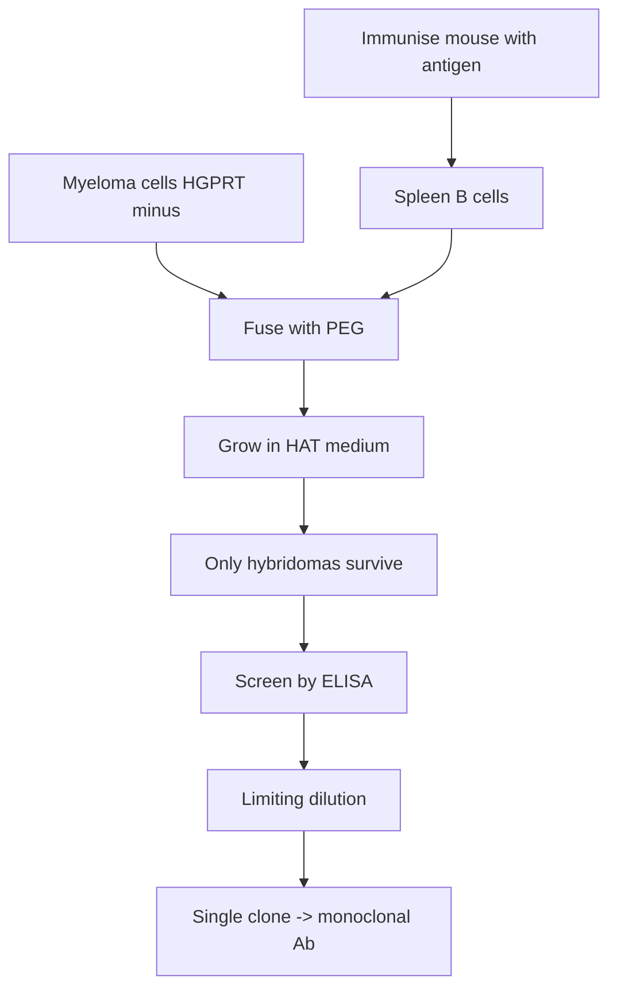
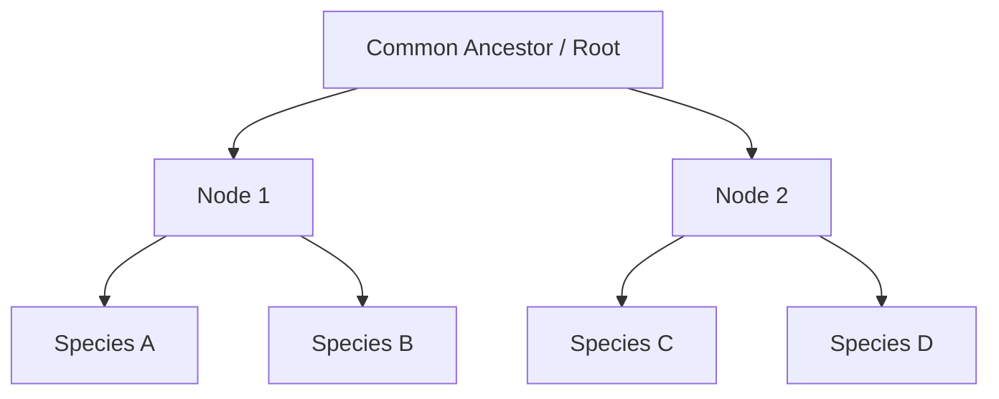

# Zoology — BSc 4th Semester Revision Sheet
### Paper: Gene Technology, Immunology & Computational Biology
**University:** Professor Rajju Bhaiya University (PRSU), Prayagraj
**Style:** Cornell notes • English • 70% BSc theory + 30% NEET/NCERT tie-in
**Use:** Last-night revision. Read the **Cue** column first, then the **Notes**, then test yourself with the **PYQ Q&A bank** at the end of each unit.

---

## How to use this sheet (5 min)
1. Skim **Syllabus Map** of each unit → tick what you already know.
2. Read **Quick Recall** boxes of every topic (fastest revision).
3. Memorise all **tables** (examiners reward tabular answers).
4. Practise the **PYQ Q&A bank** — most repeat in PRSU papers.
5. Last 30 min: read **One-Page Cheat Sheet** at the bottom.

---
---

# UNIT 1 — GENE TECHNOLOGY  *(≈ 35% weightage)*

## Syllabus map
- rDNA technology — history, scope
- Restriction enzymes & DNA-modifying enzymes
- Cloning vectors (plasmid, phage, cosmid, BAC, YAC, shuttle, expression)
- Host systems; Gene libraries (genomic vs cDNA)
- PCR + variants
- Gene cloning workflow + blue-white screening
- Blotting (Southern / Northern / Western)
- DNA sequencing (Sanger, NGS)
- DNA fingerprinting (VNTR/RFLP/STR)
- Transgenic animals, Knock-in/Knock-out, CRISPR
- Gene therapy, Recombinant insulin, Biosafety

---

### 1.1  Recombinant DNA Technology — Introduction

| Cue / Keywords | Detailed Notes (exam-answer style) | NEET Tie-in |
|---|---|---|
| **rDNA, Boyer-Cohen 1973**, chimeric DNA | Recombinant DNA is a **DNA molecule formed by joining DNA segments from two different sources** *in vitro*. Pioneered by **Stanley Cohen & Herbert Boyer (1973)** who inserted an *Xenopus* gene into *E. coli* using pSC101 plasmid. Requires three tools: (i) **Restriction enzymes** (molecular scissors), (ii) **DNA ligase** (molecular glue), (iii) **Vector** (carrier). Goal: clone, express or modify a gene. | NCERT Ch 11: rDNA = three key steps — *identification of DNA with desirable gene → introduction into host → maintenance & multiplication*. Boyer + Cohen = Father of genetic engineering. |
| **Scope & applications** | Production of **recombinant insulin (Humulin, 1982)**, growth hormone, Hep-B vaccine, monoclonal antibodies, transgenic crops/animals, gene therapy, DNA fingerprinting, GMOs. | NEET MCQ trap: first rDNA product = **Humulin (1982)** by *Eli Lilly* — not Hep-B vaccine. |

📌 **Quick Recall:** rDNA = cut + paste + carry + multiply + express. Cohen-Boyer (1973). 3 tools = enzyme + vector + host.

---

### 1.2  Restriction Endonucleases (REs)

| Cue / Keywords | Detailed Notes | NEET Tie-in |
|---|---|---|
| **Molecular scissors**; Werner Arber, Smith, Nathans — Nobel 1978 | Bacterial enzymes that **cleave double-stranded DNA at specific palindromic sequences**. Part of bacterial **restriction-modification system** (defence against phage). First RE: **HindII** (1970, H. Smith). | NEET: Nobel 1978 — Arber/Smith/Nathans. First isolated RE = **HindII**, first used in cloning = **EcoRI**. |
| **Palindrome** | A sequence reading **same 5′→3′ on both strands** e.g. EcoRI site `5′-GAATTC-3′ / 3′-CTTAAG-5′`. | NCERT diagram of EcoRI palindrome — common 1-mark MCQ. |
| **Types I, II, III** | See table below. **Type II are used in gene cloning** because they cut **within** the recognition site → predictable fragments. | Only Type II used in rDNA work. |

**Comparison of Restriction Enzyme Types**

| Feature | Type I | **Type II** ⭐ | Type III |
|---|---|---|---|
| Cleavage site | Random, far from recognition site | **Within / very close to recognition site** | 24-26 bp downstream |
| Cofactors | ATP + Mg²⁺ + SAM | **Mg²⁺ only** | ATP + Mg²⁺ |
| Enzyme activity | Restriction + methylation in one protein | Separate restriction & methylation enzymes | Both activities in one protein |
| Use in cloning | No | **Yes** | No |
| Example | EcoK | **EcoRI, BamHI, HindIII** | EcoP1 |

**Sticky vs Blunt ends**
- **Sticky / Cohesive ends** — staggered cut → single-stranded overhangs (e.g. *EcoRI* → 5′-AATT overhang). Easy to ligate.
- **Blunt ends** — straight cut, no overhang (e.g. *SmaI* `CCC↓GGG`, *HaeIII*). Harder to ligate (T4 ligase only).

**Nomenclature — EcoRI breakdown**
- **E** — genus *Escherichia*
- **co** — species *coli*
- **R** — strain RY13
- **I** — Roman numeral = order of discovery

**Star activity** — under non-standard conditions (low salt, high glycerol, Mn²⁺ instead of Mg²⁺) REs cut at sites **similar but not identical** to canonical site → unwanted cuts.

**Isoschizomers** — different enzymes, **same recognition site & cut** (HindIII & HsuI).
**Neoschizomers** — same site, **different cut position** (SmaI vs XmaI both recognise CCCGGG).
**Isocaudomers** — different sites but produce **same sticky end** (BamHI & BglII → GATC overhang).

📌 **Quick Recall:** RE = bacterial defence; Type II only in cloning; EcoRI = G↓AATTC; palindrome; sticky > blunt for ligation; star activity at low salt.

---

### 1.3  DNA-Modifying Enzymes

| Enzyme | Function | Use |
|---|---|---|
| **DNA Ligase** (T4 / E. coli) | Forms phosphodiester bond between 3′-OH & 5′-PO₄ | Seals nicks; ligates insert + vector. **T4 ligase** can join blunt ends. |
| **Alkaline phosphatase (CIP/SAP)** | Removes 5′ phosphate | Prevents vector self-ligation |
| **Polynucleotide kinase (T4 PNK)** | Adds 5′ phosphate | End-labelling with ³²P |
| **Terminal transferase (TdT)** | Adds nucleotides to 3′ end (template-independent) | **Homopolymer tailing** in cDNA cloning |
| **Klenow fragment** | Large fragment of DNA Pol I — has 5′→3′ polymerase + 3′→5′ exonuclease, **lacks 5′→3′ exonuclease** | Fills 5′ overhangs (blunting); random primer labelling |
| **Reverse transcriptase (RT)** | RNA → cDNA | cDNA library; RT-PCR. Sources: AMV, MMLV. |
| **Taq DNA Polymerase** | Heat-stable DNA pol from *Thermus aquaticus* | PCR |
| **Exonuclease III** | Removes nt from 3′ end | Sequencing prep |

📌 **Quick Recall:** Ligase = glue; CIP = prevents self-ligation; Klenow = no 5′→3′ exo; RT = RNA→DNA; Taq = thermostable.

---

### 1.4  Cloning Vectors

A **vector** is a self-replicating DNA molecule that carries a foreign DNA fragment into a host cell.

**Features of an ideal vector (mnemonic: O-M-S-S-L)**
1. **O**rigin of replication (*ori*) — autonomous replication
2. **M**ultiple cloning site (MCS / polylinker) — unique RE sites
3. **S**electable marker — antibiotic resistance gene (amp^R, tet^R)
4. **S**creenable marker — *lacZ* (blue-white)
5. **L**ow molecular weight — easy entry, more copies

**Types of vectors**

| Vector | Size of insert | Host | Key feature |
|---|---|---|---|
| **pBR322** | up to ~10 kb | E. coli | Classic plasmid; *amp^R*, *tet^R*, ori (pMB1); insertional inactivation at *BamHI* (tet) or *PstI* (amp). |
| **pUC18/19** | up to ~10 kb | E. coli | High copy no.; *amp^R* + *lacZα* (blue-white screening); polylinker in *lacZ*. |
| **λ phage (insertion / replacement)** | 5–25 kb | E. coli | Replacement vectors (EMBL3, λ-DASH) have non-essential "stuffer" region replaced by insert; in vitro packaging. |
| **Cosmid** | 35–45 kb | E. coli | Plasmid + *cos* sites of λ; packaged as phage but replicates as plasmid. |
| **Phagemid (pBluescript)** | <10 kb | E. coli | Plasmid + f1 phage ori → ssDNA possible (for sequencing). |
| **BAC** (bacterial artificial chromosome) | 100–300 kb | E. coli | Based on F-plasmid; very stable; used in HGP. |
| **YAC** (yeast artificial chromosome) | 200–2000 kb (Mb) | Yeast | Has CEN, TEL, ARS, selectable markers; largest inserts. |
| **Shuttle vector** | — | Two hosts (e.g. E. coli + yeast) | Two oris; allows propagation in two organisms. |
| **Expression vector** | — | E. coli/yeast/mammalian | Has **promoter** (lac, trp, T7, CMV), Shine-Dalgarno seq, terminator → drives **expression** of cloned gene. |

**pBR322 quick map (memorise!)** — 4361 bp; *amp^R* (β-lactamase), *tet^R*, *ori*. **PstI cuts in amp^R**, **BamHI/SalI cut in tet^R** → insertional inactivation enables selection.

📌 **Quick Recall:** Vector = ori + MCS + marker + small. pBR322 = first artificial plasmid; pUC = blue-white; λ = phage; cosmid = cos+plasmid; BAC>cosmid; YAC>BAC (largest).

---

### 1.5  Host Systems

| Host | Examples | Use |
|---|---|---|
| **Prokaryotic** | *E. coli* DH5α, BL21, JM109 | Most common; high yield; no post-translational modification |
| **Yeast** | *Saccharomyces cerevisiae*, *Pichia pastoris* | Eukaryotic processing; secretes proteins |
| **Animal cells** | CHO, HeLa, COS, HEK293 | Complex glycosylation; for therapeutic proteins (EPO, mAbs) |
| **Insect** | Sf9 (baculovirus) | High protein yield |
| **Plant** | *Agrobacterium tumefaciens* (Ti plasmid) | Transgenic plants |

📌 **Quick Recall:** E. coli — easiest; CHO — therapeutic mAbs; Agrobacterium — Ti plasmid for plants.

---

### 1.6  Gene Library

| Feature | **Genomic library** | **cDNA library** |
|---|---|---|
| Source DNA | Total genomic DNA fragmented by RE / sonication | mRNA → cDNA via **reverse transcriptase** |
| Contains | Exons + introns + regulatory + non-coding | Only **exons** (expressed genes) |
| Tissue specific? | No (same in all cells) | **Yes** — represents genes expressed in that tissue |
| Size | Very large (entire genome) | Smaller, tissue-dependent |
| Vector | λ, cosmid, BAC, YAC | Plasmid / phagemid |
| Use | Genome mapping, gene structure | Protein expression, finding mRNA species |

**cDNA library construction (5 steps)**
1. Isolate **mRNA** (oligo-dT column).
2. **First-strand synthesis** by RT using oligo-dT primer → mRNA-cDNA hybrid.
3. **RNase H** nicks mRNA → primers for second strand by DNA Pol I.
4. Add adaptors / homopolymer tails (TdT).
5. Ligate into vector → transform host.

📌 **Quick Recall:** Genomic = whole genome, includes introns; cDNA = only exons, made from mRNA via RT, tissue-specific.

---

### 1.7  Polymerase Chain Reaction (PCR) ⭐ HOT TOPIC

**Definition:** *In vitro* amplification of a specific DNA segment producing millions of copies in a few hours. Invented by **Kary Mullis (1983, Nobel 1993)**.

**Components**
1. Template DNA
2. Two **primers** (forward & reverse, 18–25 nt)
3. **Taq DNA polymerase** (heat-stable, from *Thermus aquaticus*)
4. **dNTPs** (dATP, dTTP, dGCP, dCTP)
5. **Buffer + MgCl₂**
6. Thermal cycler

**Three steps per cycle**

| Step | Temperature | Time | Event |
|---|---|---|---|
| 1. **Denaturation** | 94–95 °C | 30 s | dsDNA → ssDNA (H-bonds break) |
| 2. **Annealing** | 50–65 °C (Tm − 5°C) | 30 s | Primers bind complementary ssDNA |
| 3. **Extension** | 72 °C | 1 min/kb | Taq adds dNTPs 5′→3′ |

**Amplification:** after *n* cycles → **2ⁿ copies**. 30 cycles → ~10⁹ copies.


**Variants of PCR**

| Variant | Special feature | Use |
|---|---|---|
| **RT-PCR** | Reverse-transcriptase converts RNA→cDNA first | mRNA detection, viral RNA (e.g. SARS-CoV-2) |
| **qPCR / Real-Time PCR** | Fluorescent dye (SYBR Green) or probe (TaqMan) measures product **per cycle** → Ct value | Quantification of gene expression / viral load |
| **Nested PCR** | Two rounds with two primer pairs (outer + inner) | Increases specificity |
| **Multiplex PCR** | Several primer pairs in same tube | Detects multiple targets simultaneously |
| **Inverse PCR** | Primers face outward; amplifies unknown flanking DNA | Mapping insertions |
| **Hot-start PCR** | Polymerase activated only at high temp | Reduces non-specific products |

**Applications:** Diagnostics (COVID-19, TB, HIV), DNA fingerprinting, cloning, mutagenesis, prenatal diagnosis, forensics.

📌 **Quick Recall:** Mullis 1983; 3 steps 95-55-72; 2ⁿ amplification; Taq = thermostable; RT-PCR for RNA; qPCR for quantification.

---

### 1.8  Gene Cloning Workflow



**Transformation methods**
- **Chemical (CaCl₂ + heat-shock at 42 °C for 90 s)** — for *E. coli*.
- **Electroporation** — brief electric pulse opens transient pores.
- **Microinjection / biolistic (gene gun)** — eukaryotic cells.

**Blue-White Screening (memorise mechanism!)**
- Vector pUC18 carries **lacZα** gene.
- Host strain has **lacZΩ** → α-complementation produces functional β-galactosidase.
- β-gal cleaves **X-gal** (substrate, induced by **IPTG**) → **blue colour**.
- Insertion of foreign DNA at MCS (inside lacZα) **disrupts lacZα** → **no β-gal → white colony** = **recombinant**.
- Blue = non-recombinant; **White = recombinant** ⭐.

📌 **Quick Recall:** White = recombinant; X-gal = substrate; IPTG = inducer; α-complementation; insertional inactivation of lacZ.

---

### 1.9  Blotting Techniques

| Feature | **Southern** | **Northern** | **Western** |
|---|---|---|---|
| Target | **DNA** | **RNA / mRNA** | **Protein** |
| Probe | Labelled ssDNA / RNA | Labelled ssDNA / RNA | Antibody (1° + 2°) |
| Inventor | E.M. Southern (1975) | (named after Southern) | W.N. Burnette (1981) |
| Detection | Autoradiography | Autoradiography | Chemiluminescence / colour |
| Use | Gene presence, RFLP, DNA fingerprinting | Gene expression at transcript level | Protein expression; HIV confirmatory test |

**Southern blotting procedure (7 steps — write in order!)**
1. **Extract** genomic DNA.
2. **Digest** with restriction enzyme.
3. **Agarose gel electrophoresis** to separate by size.
4. **Denature** in alkaline buffer (NaOH) → ssDNA.
5. **Transfer** to nitrocellulose/nylon membrane by capillary action.
6. **Hybridise** with ³²P-labelled probe complementary to gene of interest.
7. **Autoradiography** → bands visible on X-ray film.

📌 **Quick Recall:** SNoW DRoP — Southern=DNA, Northern=RNA, Western=Protein. Western uses **antibody** as probe.

---

### 1.10  DNA Sequencing

**Sanger Dideoxy Chain Termination Method (1977 — Nobel 1980)**
- Reaction mix: template, primer, DNA Pol I, dNTPs + small amount of **ddNTPs** (chain terminators — lack 3′-OH so no further extension).
- 4 tubes (each with one ddNTP: ddATP, ddTTP, ddGTP, ddCTP).
- Synthesis produces fragments of varying lengths terminating at every position of that base.
- Run on polyacrylamide gel (4 lanes) → read sequence **bottom→top = 5′→3′**.
- **Automated Sanger:** fluorescent ddNTPs (4 colours) → single capillary, laser detector → chromatogram.

**Next-Generation Sequencing (NGS) — Illumina**
- DNA fragmented → adaptors ligated → **bridge amplification** on flow cell → **sequencing-by-synthesis** with reversible-terminator dNTPs (each cycle reads 1 base, 4 colours).
- High throughput; reads short (150–300 bp); used in HGP-rerun, metagenomics, cancer genomics.

📌 **Quick Recall:** Sanger = ddNTP chain termination, 4 tubes; NGS = massively parallel, short reads, Illumina dominant; HGP completed 2003.

---

### 1.11  DNA Fingerprinting

- Developed by **Alec Jeffreys (1984, Leicester)**.
- Exploits **highly polymorphic non-coding repeat sequences** unique to each individual (except identical twins).

**Repeat types**
| Type | Repeat size | Location |
|---|---|---|
| **VNTR (minisatellite)** | 10–100 bp | Scattered |
| **STR (microsatellite)** | 2–6 bp (e.g. CA repeats) | Throughout genome — used in modern forensics & CODIS |
| **RFLP** | Variation in restriction site → fragment-length polymorphism | Original Jeffreys method |

**Steps (RFLP method)**
1. Isolate DNA (blood, semen, hair root, saliva, bone).
2. Digest with RE (e.g. *HinfI*).
3. Gel electrophoresis.
4. Southern blot transfer.
5. Hybridise with multilocus VNTR probe (³²P).
6. Autoradiograph → barcode-like pattern.
7. Compare suspect vs evidence.

**Applications:** Forensics (rape, murder), paternity disputes, identification of bodies (tsunami, 9/11), wildlife conservation, immigration disputes.

📌 **Quick Recall:** Jeffreys 1984; VNTR/STR/RFLP; Southern + radiolabel; STR used by modern CODIS.

---

### 1.12  Transgenic Animals

A **transgenic animal** has a **foreign gene (transgene) stably integrated into its genome** and inherited by progeny.

**Methods**
1. **DNA microinjection** — direct injection into pronucleus of fertilised egg → implant in foster mother. Most common in mice.
2. **Retroviral vector** — defective retrovirus delivers gene.
3. **Embryonic Stem (ES) cell method** — modify ES cells in vitro → inject into blastocyst → chimera → breed.
4. **Sperm-mediated gene transfer**, **electroporation**, **biolistic**.

**Knock-out vs Knock-in**
| Type | Definition | Use |
|---|---|---|
| **Knock-out** | Target gene **inactivated** by homologous recombination | Study gene function (loss-of-function) |
| **Knock-in** | Gene **inserted/replaced at specific locus** | Express reporter, humanised mouse model |
| **Cre-Lox system** | *loxP* sites flank target; Cre recombinase excises → **conditional knock-out** | Tissue/time-specific deletion |

**Famous examples**
- **First transgenic mouse** — Rudolph Jaenisch, 1974.
- **Super-mouse** — rat GH gene → bigger mice (Palmiter & Brinster).
- **Dolly the sheep (1996)** — first cloned mammal, **somatic cell nuclear transfer (SCNT)** by Ian Wilmut. (Cloning, not strictly transgenic.)
- **GloFish** — transgenic zebrafish with jellyfish GFP.
- **OncoMouse** — knock-in of oncogene; first patented animal.
- **Enviropig** — phytase-producing pig.

📌 **Quick Recall:** Microinjection most common; KO = loss-of-function; Cre-Lox = conditional; Dolly = SCNT (cloned, not transgenic).

---

### 1.13  Gene Therapy

**Definition:** Introduction of a functional gene into patient's cells to treat genetic disease.

| Approach | Procedure |
|---|---|
| **Ex vivo** | Cells removed → modified in vitro → reintroduced (e.g. bone marrow for SCID) |
| **In vivo** | Vector injected directly into patient (e.g. AAV into liver/eye) |
| **Germline** (banned in humans) | Modifies sperm/egg/embryo — heritable |
| **Somatic** (allowed) | Modifies somatic cells — not heritable |

**Vectors:** Retrovirus, **Adenovirus**, **AAV (adeno-associated virus)**, Lentivirus, liposomes, naked DNA.

**Landmark case — SCID-ADA deficiency**
- Patient: **Ashanti DeSilva, 1990** (W. French Anderson, NIH).
- Disease: adenosine deaminase (ADA) gene mutation → no T/B cells ("bubble baby").
- Therapy: lymphocytes withdrawn → functional ADA gene inserted via retrovirus → reinfused.

**CRISPR-Cas9 (Doudna & Charpentier, Nobel 2020)**
- **CRISPR** = Clustered Regularly Interspaced Short Palindromic Repeats — bacterial adaptive immunity.
- Components: **guide RNA (gRNA)** + **Cas9 nuclease**.
- gRNA directs Cas9 to a target sequence next to a **PAM (NGG)** → Cas9 creates **double-strand break** → repaired by **NHEJ (knock-out)** or **HDR (knock-in)**.
- Uses: gene editing, sickle-cell therapy (Casgevy, 2023 — first approved CRISPR drug).

📌 **Quick Recall:** First gene therapy = ADA-SCID, 1990, Ashanti DeSilva; AAV common vector; CRISPR — Nobel 2020.

---

### 1.14  Recombinant Insulin (Humulin) — must-write 10-mark answer

**Steps:**
1. Two **synthetic genes** for insulin A-chain (21 aa) and B-chain (30 aa) chemically synthesised.
2. Each gene cloned into **pBR322 plasmid** fused with *lacZ* gene.
3. Plasmids transformed into separate *E. coli* cultures.
4. Induce with IPTG → fusion proteins (β-gal-A and β-gal-B chain) expressed.
5. Treat with **cyanogen bromide** to cleave β-gal portion.
6. Purify A and B chains.
7. Mix chains under oxidising conditions → **disulfide bonds form** (2 inter, 1 intra) → active human insulin.
8. First marketed as **Humulin** by **Eli Lilly, 1982** (FDA approved).

**Other recombinant therapeutics:** Human growth hormone, erythropoietin (EPO), Hep-B surface antigen vaccine, Factor VIII, tPA, interferons.

📌 **Quick Recall:** A + B chain separate genes → pBR322 → E. coli → CNBr cleavage → S–S linkage → Humulin (1982).

---

### 1.15  Biosafety & Bioethics

- **GEAC** — Genetic Engineering Appraisal Committee (under MoEF, India) — approves GMO release.
- **RCGM** — Review Committee on Genetic Manipulation (under DBT).
- **IBSC** — Institutional Biosafety Committee.
- **Biosafety levels (BSL 1–4):** BSL1 = no/low risk (E. coli K12); BSL2 = moderate (HepB); BSL3 = TB, SARS; **BSL4 = Ebola, Marburg, smallpox** (max containment, positive-pressure suit).
- **Bioethics issues:** germline editing, designer babies, GM food safety, cloning of humans, patenting of life forms (Diamond v. Chakrabarty 1980).

📌 **Quick Recall:** GEAC = release approval; BSL4 = Ebola; Diamond v. Chakrabarty = first patent on living organism (oil-eating *Pseudomonas*).

---

## Unit 1 — PYQ Style Q&A Bank

### Short Answer (2–3 marks)
1. **Define palindromic sequence with example.** — Sequence reading the same 5′→3′ on both strands; e.g. EcoRI site 5′-GAATTC-3′/3′-CTTAAG-5′.
2. **Differentiate sticky vs blunt ends.** — Sticky: staggered cut, ssDNA overhang, easy ligation (EcoRI); Blunt: straight cut, no overhang, T4-ligase only (SmaI).
3. **What is blue-white screening?** — Selection technique on X-gal + IPTG plates; recombinant pUC colonies appear white (lacZα disrupted), non-recombinants blue.
4. **Functions of Taq polymerase in PCR.** — Heat-stable DNA polymerase from *Thermus aquaticus*; extends primers at 72 °C; survives 95 °C denaturation.
5. **What are cosmids?** — Hybrid vectors with plasmid origin + λ *cos* sites; packaged as phage but replicate as plasmid; can carry 35–45 kb inserts.

### Long Answer (10 marks each)
1. **Describe the construction and uses of cDNA library.** — Intro (define) → Diagram (mRNA→cDNA→vector) → Steps (mRNA isolation by oligo-dT → RT first strand → RNase H + DNA Pol II second strand → adaptor ligation → vector ligation → transformation) → Comparison with genomic library (tissue-specific, exon-only) → Uses (cloning expressed genes, finding rare mRNAs, microarray probes, recombinant proteins) → Conclusion.
2. **Explain PCR — principle, steps, types and applications.** — Intro (Mullis 1983) → Components → Mermaid flow of 3 steps with temps → 2ⁿ amplification → Variants table (RT, qPCR, nested, multiplex, inverse) → Applications (diagnostics, forensics, cloning, sequencing prep) → Conclusion.
3. **Describe production of recombinant human insulin.** — Intro → Diagram (two chains pathway) → 8-step procedure as above → CNBr cleavage and S–S formation → Humulin 1982, Eli Lilly → Advantages over animal insulin (no allergy, unlimited supply) → Conclusion.

---
---

# UNIT 2 — IMMUNOLOGY  *(≈ 35% weightage)*

## Syllabus map
- Innate vs adaptive immunity
- Cells & organs of immune system
- Antigens & antibodies (structure + classes)
- Antigen-antibody reactions (precipitation, agglutination, ELISA, RIA, IF)
- MHC I & II
- Complement system
- Hypersensitivity (I-IV)
- Autoimmune diseases & immunodeficiency (SCID, AIDS)
- Vaccines (types, mRNA)
- Hybridoma & monoclonal antibodies

---

### 2.1  Introduction & Types of Immunity

| Cue | Notes | NEET |
|---|---|---|
| **Immunity** | Body's ability to resist & eliminate pathogens / foreign substances. **Father of immunology = Edward Jenner (smallpox vaccine, 1796)**. Term "immunology" by Louis Pasteur. | NCERT Ch 8: Jenner — cowpox → smallpox. |
| **Innate vs Adaptive** | Innate = present at birth, non-specific, no memory, rapid (mins-hrs). Adaptive = acquired, **specific**, has **memory**, slow (days), improves on re-exposure. | Innate = 1st & 2nd line; adaptive = 3rd line. |
| **Active vs Passive** | Active: own immune system makes Ab (infection / vaccine) — long-lasting. Passive: ready-made Ab given (mother→foetus IgG via placenta, IgA via colostrum; ATS, anti-snake venom) — short-lasting. | NEET trap: colostrum = IgA passive immunity. |

**Comparison of immunity types**

| Feature | **Innate** | **Adaptive (Acquired)** |
|---|---|---|
| Specificity | Non-specific | **Highly specific** |
| Memory | Absent | **Present** |
| Response time | Immediate | 5–14 days first exposure |
| Components | Skin, mucus, phagocytes, NK, complement, IFN | T cells, B cells, antibodies |
| Diversity | Limited | ~10¹⁰ different specificities |
| Examples | Inflammation, fever | Vaccination, post-infection immunity |

**Four barriers of innate immunity**
1. **Physical** — skin, mucous membrane, cilia.
2. **Physiological** — pH, temperature, lysozyme in tears/saliva, HCl in stomach.
3. **Cellular** — neutrophils, macrophages, NK cells, dendritic cells.
4. **Cytokine** — interferons, complement.

📌 **Quick Recall:** Jenner = smallpox; innate = fast, non-specific; adaptive = specific + memory; colostrum = IgA.

---

### 2.2  Cells & Organs of the Immune System

**Primary lymphoid organs (production + maturation)**
- **Bone marrow** — all blood cells origin; **B-cell maturation**.
- **Thymus** — **T-cell maturation** (positive + negative selection); large at birth, atrophies after puberty.

**Secondary lymphoid organs (antigen capture + lymphocyte activation)**
- **Spleen** — filters blood; large reservoir of lymphocytes.
- **Lymph nodes** — filter lymph; dendritic cells present antigens.
- **MALT** — mucosa-associated (Peyer's patches in gut, tonsils, BALT in bronchi).

**Cells of immune system**

| Cell | Function |
|---|---|
| **Neutrophil** | Phagocytosis; first responder; pus-forming |
| **Macrophage** (tissue) / Monocyte (blood) | Phagocytosis + antigen presentation; cytokine secretion |
| **Eosinophil** | Anti-parasite; allergic response |
| **Basophil / Mast cell** | Release histamine in allergy (IgE-mediated) |
| **Dendritic cell** | **Professional APC**; activates naïve T cells |
| **Natural Killer (NK)** | Kills virus-infected & tumour cells (no MHC needed); part of innate |
| **B lymphocyte** | Humoral immunity; produces antibodies; matures into **plasma cells** + memory cells |
| **T lymphocyte** | Cell-mediated immunity. Subsets: **TH (CD4⁺)** — helper; **TC (CD8⁺)** — cytotoxic; **Treg** — regulatory; **TH17** — inflammation. |

📌 **Quick Recall:** B = Bone marrow + antiBody; T = Thymus. CD4 = helper, CD8 = killer. NK = innate killer (no antigen specificity).

---

### 2.3  Antigens

| Term | Definition |
|---|---|
| **Antigen (Ag)** | Any substance that **induces an immune response** (immunogen) and **binds specifically to an antibody / TCR**. Usually >10 kDa, protein/polysaccharide. |
| **Epitope (antigenic determinant)** | The **small region** of antigen actually recognised by Ab/TCR (5–15 aa or sugars). One antigen has multiple epitopes. |
| **Paratope** | Antigen-binding site on antibody. |
| **Hapten** | Low MW, non-immunogenic alone, but immunogenic when conjugated to a **carrier protein** (Landsteiner). E.g. penicillin, dinitrophenol. |
| **Adjuvant** | Substance that **enhances** immune response to antigen (e.g. **Freund's adjuvant**, alum, MF59). |
| **Immunogenicity factors** | Foreignness, MW (>10 kDa), chemical complexity, dose, route. |

📌 **Quick Recall:** Hapten = needs carrier; Adjuvant = enhances; Epitope = recognised region.

---

### 2.4  Antibody (Immunoglobulin) Structure ⭐

**Definition:** Y-shaped glycoproteins produced by plasma cells, secreted into blood/secretions, bind specifically to antigens.

**Basic structure** (Porter & Edelman, Nobel 1972)
- **4 polypeptide chains** — 2 identical **heavy (H)** chains (~50 kDa) + 2 identical **light (L)** chains (~25 kDa). Total ~150 kDa.
- Held by **inter-chain disulfide (S–S) bonds** + non-covalent forces.
- Each chain has **Variable (V)** region (N-terminal) + **Constant (C)** region (C-terminal).
- **Antigen-binding site** formed by VH + VL (paratope).
- **CDRs (Complementarity-Determining Regions)** — hypervariable loops in V region that contact antigen.

**Functional fragments (papain digestion)**
- **2 Fab fragments** — antigen binding (Fragment antigen binding).
- **1 Fc fragment** — crystallisable; binds complement & Fc-receptors; determines class.
- **Hinge region** — between Fab and Fc; gives flexibility.



**Five Classes of Antibodies (memorise table)**

| Class | Heavy chain | Structure | Serum % | Key functions / location |
|---|---|---|---|---|
| **IgG** | γ (gamma) | Monomer | **75%** (most abundant) | Secondary response; **only Ig that crosses placenta**; opsonisation; complement (classical); 4 subclasses IgG1-4 |
| **IgM** | μ (mu) | **Pentamer** + J chain | 10% | **First Ab in primary response**; strongest complement activator; BCR on naïve B-cell (monomer); largest Ab |
| **IgA** | α (alpha) | Dimer + J + secretory piece | 15% | **Mucosal immunity**; in tears, saliva, **colostrum**, gut secretions; first line at mucosa |
| **IgE** | ε (epsilon) | Monomer | 0.002% | **Allergy** (Type I hypersensitivity); parasites; binds mast cells via Fcε receptor → histamine release |
| **IgD** | δ (delta) | Monomer | <1% | **BCR on mature naïve B-cells**; function poorly understood |

**Mnemonic:** "**G**eneral, **M**onstrous, **A**t mucosa, **E**llergy, **D**unno" (G M A E D).

📌 **Quick Recall:** IgG = placenta, most abundant; IgM = pentamer, first, primary response; IgA = colostrum, mucosal; IgE = allergy + parasites + mast cells; IgD = BCR.

---

### 2.5  Antigen-Antibody Reactions

| Reaction | Principle | Use |
|---|---|---|
| **Precipitation** | Soluble Ag + Ab → insoluble precipitate at zone of equivalence. Methods: ring test, immunodiffusion (Ouchterlony), radial immunodiffusion (Mancini). | Ag quantification |
| **Agglutination** | Particulate Ag (RBC, bacteria) + Ab → visible clumps. | **Blood grouping (ABO)**, Widal (typhoid), VDRL |
| **Complement Fixation** | Ag-Ab consumes complement → no lysis of sheep RBC in indicator | Old syphilis test (Wassermann) |
| **ELISA** | Ag/Ab adsorbed on plate; enzyme-conjugate (HRP/AP) catalyses chromogenic substrate → colour | **HIV screening**, pregnancy test, COVID-Ab, hormone assays |
| **RIA** (Radioimmunoassay) | Radio-labelled (¹²⁵I) Ag competes with sample Ag for limited Ab | Hormones (insulin) — Yalow Nobel 1977 |
| **Immunofluorescence (IF)** | Ab tagged with fluorescent dye (FITC, rhodamine) → detected under UV microscope. Direct vs indirect. | Tissue antigen localisation, autoimmune Dx |
| **Western blot** | Protein separated on SDS-PAGE → transferred → detected by labelled Ab | **HIV confirmatory test** |
| **Flow cytometry / FACS** | Cells tagged with fluorescent Ab → laser-based sorting | CD4 count, leukaemia phenotyping |

**ELISA types**
- **Direct** — Ag on plate; enzyme-Ab binds Ag.
- **Indirect** — Ag on plate; primary Ab → enzyme-secondary Ab (**used in HIV**).
- **Sandwich** — Capture Ab on plate → Ag → detection Ab-enzyme (used for hormones, cytokines).
- **Competitive** — labelled Ag competes with sample Ag.

📌 **Quick Recall:** ELISA = HIV screening; Western = HIV confirmatory; Agglutination = blood grouping; RIA = hormones.

---

### 2.6  MHC (Major Histocompatibility Complex)

- In humans called **HLA (Human Leukocyte Antigen)** — chromosome **6**.
- **Highly polymorphic** glycoproteins on cell surface that present antigenic peptides to T cells.
- Discovered by Snell, Dausset, Benacerraf — Nobel 1980.

| Feature | **MHC Class I** | **MHC Class II** |
|---|---|---|
| Expressed on | **All nucleated cells** + platelets | **APCs only** — dendritic, macrophage, B cell |
| Structure | 1 α chain + β2-microglobulin | α + β chains |
| Peptide source | **Endogenous** (cytoplasmic — virus, tumour) | **Exogenous** (phagocytosed) |
| Peptide size | 8–10 aa | 13–18 aa |
| Presents to | **CD8⁺ Tc cells** | **CD4⁺ TH cells** |
| HLA loci | HLA-A, B, C | HLA-DP, DQ, DR |
| Processing pathway | Proteasome → TAP → ER | Endosome → lysosome → MIIC |



**Importance:** Transplant rejection (HLA matching), self vs non-self, T-cell activation, autoimmunity (HLA-B27 ↔ ankylosing spondylitis).

📌 **Quick Recall:** MHC-I = all cells + CD8 + endogenous; MHC-II = APC + CD4 + exogenous; chromosome 6.

---

### 2.7  Complement System

**Definition:** ~30 heat-labile plasma proteins (C1–C9 + factors B, D, P, H, I) that **enhance (complement)** Ab + phagocyte action via a cascade ending in **MAC formation** → cell lysis.

**Three pathways converge at C3 cleavage**

| Pathway | Trigger | Initiation |
|---|---|---|
| **Classical** | **Ag-Ab complex** (IgM/IgG bound to Ag) | C1q-r-s binds Fc → activates C4, C2 → C3 convertase (C4b2a) |
| **Alternative** | Microbial surface (LPS, zymosan) — no Ab needed | Spontaneous C3 hydrolysis → C3bBb (with factor B, D, properdin) |
| **Lectin** | MBL (mannose-binding lectin) on microbe sugars | MBL-MASP cleaves C4, C2 → C3 convertase |

**Common terminal pathway:** C3 → C3a + C3b → C5 convertase → C5 → C5a + C5b → **C5b + C6, C7, C8, C9 → MAC (Membrane Attack Complex)** → pore in microbe → osmotic lysis.



**Functions of complement**
1. **Cell lysis** (MAC).
2. **Opsonisation** (C3b coats microbe → phagocytosis).
3. **Inflammation** (C3a, C5a — **anaphylatoxins**; C5a = strong chemoattractant for neutrophils).
4. **Immune complex clearance**.
5. **B-cell activation** (C3d).

📌 **Quick Recall:** C1 starts classical; C3 = central; MAC = C5b-9; C3a/C5a = anaphylatoxins; C5a = chemotaxis.

---

### 2.8  Hypersensitivity (Coombs & Gell Classification)

| Type | Name | Mediator | Mechanism | Time | Examples |
|---|---|---|---|---|---|
| **I** | Immediate / Allergic | **IgE** + mast cells | IgE on mast cells → Ag cross-links → histamine release | mins | Hay fever, asthma, anaphylaxis, food allergy |
| **II** | Cytotoxic | **IgG/IgM** + complement | Ab binds cell-surface Ag → complement / NK lyses cell | hrs-days | Transfusion reaction, **erythroblastosis fetalis (Rh)**, Goodpasture's |
| **III** | Immune complex | **IgG + soluble Ag** | Ag-Ab complexes deposit in tissues → complement + neutrophils | hrs | Serum sickness, **SLE**, **rheumatoid arthritis**, Arthus reaction, post-streptococcal glomerulonephritis |
| **IV** | Delayed (cell-mediated) | **T cells (TH1, Tc)** — NO antibody | Sensitised T cells release cytokines / kill cell | 24–72 hrs | **Mantoux/tuberculin test**, contact dermatitis (poison ivy, nickel), TB granuloma, graft rejection |

**Mnemonic:** **A**llergy – **C**ytotoxic – **I**mmune complex – **D**elayed (ACID).

📌 **Quick Recall:** I=IgE, II=IgG-cell, III=immune complex, IV=T cell delayed. Mantoux is the classic Type IV.

---

### 2.9  Autoimmune Diseases

| Disease | Target / Auto-Ab |
|---|---|
| **Rheumatoid arthritis** | Anti-IgG (Rheumatoid factor); synovial joints |
| **SLE (Lupus)** | Anti-dsDNA, anti-Sm, ANA; multi-organ |
| **Multiple sclerosis (MS)** | Myelin sheath in CNS |
| **Type 1 Diabetes** | β-cells of pancreas (anti-GAD, anti-insulin) |
| **Myasthenia gravis** | Anti-AChR (neuromuscular junction) — muscle weakness |
| **Graves' disease** | Anti-TSH-receptor → hyperthyroidism |
| **Hashimoto's thyroiditis** | Anti-thyroglobulin → hypothyroidism |
| **Goodpasture's** | Anti-basement membrane (lung + kidney) |

📌 **Quick Recall:** RA = anti-IgG; SLE = anti-dsDNA; T1DM = β-cell; MG = anti-AChR.

---

### 2.10  Immunodeficiency

**Primary (genetic)**
- **SCID (Severe Combined Immunodeficiency)** — defect in T & B cells. Causes: ADA deficiency, X-linked γc chain mutation. "Bubble baby" → bone-marrow transplant or gene therapy.
- **DiGeorge syndrome** — thymus aplasia → no T cells.
- **Bruton's agammaglobulinaemia** — X-linked; no B cells / Ig.

**Secondary (acquired)**
- **AIDS — Acquired Immunodeficiency Syndrome**
  - **Cause:** HIV-1, HIV-2 (Retroviridae, Lentivirus; ssRNA + reverse transcriptase).
  - **Target:** **CD4⁺ T helper cells**, macrophages, dendritic cells via **gp120 → CD4 + CCR5/CXCR4 co-receptor**.
  - **Transmission:** sexual, blood, mother-to-child, needles.
  - **Course:** Acute → asymptomatic (latency) → AIDS (CD4 < 200/µL).
  - **Opportunistic infections:** *Pneumocystis jirovecii* pneumonia, TB, candidiasis, Kaposi sarcoma.
  - **Dx:** **ELISA (screening) → Western blot (confirmation)**; PCR for viral RNA load.
  - **Rx:** HAART/ART (zidovudine = RT inhibitor; protease inhibitors; integrase inhibitors).
- Others: malnutrition, chemotherapy, corticosteroids, splenectomy.

📌 **Quick Recall:** HIV kills CD4 cells; gp120 binds CD4; ELISA + Western blot dx; CD4<200 = AIDS.

---

### 2.11  Vaccines

**Definition:** Antigenic preparation that induces **active acquired immunity** without disease.

| Type | Description | Example |
|---|---|---|
| **Live attenuated** | Weakened pathogen; strongest response, long-lasting; 1 dose | **MMR, BCG, OPV (Sabin), Yellow fever, Varicella** |
| **Killed / Inactivated** | Heat/chemical-killed pathogen; safer but weaker | **IPV (Salk), Hep A, Rabies, Whole-cell pertussis, Cholera** |
| **Subunit / Recombinant** | Only antigenic part (protein) | **Hep-B (HBsAg from yeast)**, HPV, acellular pertussis |
| **Toxoid** | Inactivated bacterial toxin | **Tetanus toxoid (TT), Diphtheria** |
| **Conjugate** | Polysaccharide + carrier protein | **Hib, Pneumococcal, Meningococcal** |
| **DNA vaccine** | Plasmid encoding antigen injected → host cell expresses | Veterinary (West Nile in horses) |
| **mRNA vaccine** | mRNA in lipid nanoparticle → host ribosome makes antigen | **Pfizer-BioNTech & Moderna COVID-19** |
| **Viral vector** | Engineered harmless virus carries gene | **Covishield (ChAdOx1), J&J COVID** |

**Cold chain temperatures:** OPV –20 °C; most others +2 to +8 °C; mRNA –70 °C (Pfizer).

📌 **Quick Recall:** Live = strongest, contraindicated in immunocompromised; mRNA = COVID; Hep-B = subunit recombinant from yeast.

---

### 2.12  Hybridoma & Monoclonal Antibodies (mAb)

**Köhler & Milstein, 1975 — Nobel 1984.**

**Procedure (must memorise diagram!)**
1. **Immunise mouse** with antigen → spleen rich in B-plasma cells (Ab-producing but mortal).
2. **Isolate spleen B-cells**.
3. **Fuse** with **myeloma cells** (immortal, **HGPRT⁻**) using **PEG (polyethylene glycol)**.
4. Culture in **HAT medium** (Hypoxanthine, Aminopterin, Thymidine):
   - Aminopterin blocks de novo nucleotide synthesis.
   - Cells must use salvage pathway via **HGPRT**.
   - Unfused myeloma → die (HGPRT⁻); unfused B-cells → die naturally; only **hybridoma (B-cell HGPRT + myeloma immortality) survives**.
5. **Screen** clones by ELISA for desired Ab specificity.
6. Clone by **limiting dilution** → single hybridoma → expand → **monoclonal Ab**.



**Applications:** Cancer therapy (**Rituximab — CD20**, **Trastuzumab — HER2**, **Bevacizumab — VEGF**), autoimmune (Infliximab — TNFα), pregnancy test, diagnostics (ELISA), HIV CD4 count, blood typing.

📌 **Quick Recall:** Köhler-Milstein 1975; PEG fusion; HAT selection; HGPRT⁻ myeloma; mAb -mab suffix; Rituximab anti-CD20.

---

## Unit 2 — PYQ Style Q&A Bank

### Short Answer
1. **Differentiate innate and adaptive immunity.** — Innate: non-specific, no memory, rapid; Adaptive: specific, memory, slow first time.
2. **Why is IgM the first antibody in primary response?** — Because IgH gene of naïve B-cells initially transcribes μ chain; IgM pentamer has high avidity, suitable before class switching.
3. **Define hapten with example.** — Small molecule (<1 kDa) non-immunogenic alone; becomes immunogenic when conjugated with carrier protein. E.g. penicillin, DNP.
4. **What is the role of CD4 in HIV infection?** — Gp120 of HIV binds CD4 receptor of TH cell + CCR5 co-receptor → viral entry → progressive CD4 depletion → AIDS.
5. **Distinguish MHC I and MHC II.** — MHC I on all nucleated cells, presents endogenous Ag to CD8 Tc; MHC II on APCs only, presents exogenous Ag to CD4 TH.

### Long Answer
1. **Describe structure and classes of immunoglobulins.** — Intro (definition, Porter-Edelman) → Diagram (4 chains, V/C, Fab/Fc, hinge, S–S) → CDRs/paratope → Papain & pepsin cleavage → Table of 5 classes with H chain, structure, function, location → Conclusion.
2. **Explain complement system and its biological functions.** — Intro (define + heat-labile, ~30 proteins) → Mermaid of 3 pathways converging at C3 → Steps of classical pathway → MAC formation → 5 functions (lysis, opsonisation, inflammation, IC clearance, B-cell activation) → Conclusion.
3. **Production and applications of monoclonal antibodies.** — Intro (Köhler-Milstein 1975) → Diagram → Step-wise procedure (immunise → spleen + myeloma fuse with PEG → HAT selection → screen → clone) → Applications (cancer mAbs, diagnostics, ELISA, therapeutics) → Conclusion.

---
---

# UNIT 3 — COMPUTATIONAL BIOLOGY / BIOINFORMATICS  *(≈ 30% weightage)*

## Syllabus map
- Scope, history, branches
- Biological databases (NCBI, EMBL, DDBJ, UniProt, PDB, KEGG, Ensembl)
- File formats (FASTA, GenBank, PDB)
- Sequence alignment (pairwise — global vs local; multiple)
- Scoring matrices (PAM, BLOSUM)
- BLAST + FASTA tools
- Phylogenetic analysis (UPGMA, NJ, ML, MP)
- HGP, gene prediction, structural bioinformatics, drug design

---

### 3.1  Introduction to Bioinformatics

| Cue | Notes | NEET |
|---|---|---|
| **Definition** | Interdisciplinary field applying **computer science, statistics & mathematics** to manage and analyse biological data (sequence, structure, expression). Term coined by **Paulien Hogeweg & Ben Hesper (1970)**. | NCERT Ch 6: data of HGP needed bioinformatics tools. |
| **Goals** | (1) Organise biological data in databases. (2) Develop tools for analysis. (3) Interpret results biologically. | — |
| **Branches** | Genomics, proteomics, transcriptomics, metabolomics, structural bioinformatics, phylogenomics, drug design, systems biology. | — |
| **Applications** | Genome assembly (HGP), drug discovery, vaccine design (reverse vaccinology), personalised medicine, evolutionary biology, agriculture (GM crops), forensics. | NEET: HGP completed **2003**. |

📌 **Quick Recall:** Bioinformatics = bio + IT; goal = data + tools + interpretation; key driver = HGP.

---

### 3.2  Biological Databases

**Types**
- **Primary** — raw experimental data submitted by researchers (sequence DBs).
- **Secondary** — derived/curated info (motifs, domains, structures).
- **Composite** — combine multiple sources.

| Database | Type | Content | Hosted by |
|---|---|---|---|
| **GenBank** | Primary | Nucleotide sequences | NCBI (USA) |
| **EMBL-Bank / ENA** | Primary | Nucleotide | EBI (Europe) |
| **DDBJ** | Primary | Nucleotide | NIG (Japan) |
| *(GenBank, EMBL, DDBJ exchange data daily — INSDC consortium)* | | | |
| **UniProt (SwissProt + TrEMBL)** | Primary/Curated | Protein sequences | EBI/SIB |
| **PIR** | Protein | (older) | Georgetown Univ. |
| **PDB (Protein Data Bank)** | Primary | 3D macromolecular structures | RCSB |
| **PubMed / MEDLINE** | Literature | Biomedical articles | NCBI |
| **OMIM** | Secondary | Human genes & disorders | NCBI |
| **KEGG** | Secondary | Pathways, genomes | Kanehisa Lab, Japan |
| **Pfam / InterPro** | Secondary | Protein families & domains | EBI |
| **PROSITE** | Secondary | Motifs / patterns | SIB |
| **Ensembl** | Composite | Eukaryotic genomes | EBI/Sanger |
| **UCSC Genome Browser** | Composite | Genome annotation | UCSC |

📌 **Quick Recall:** Big-3 nucleotide = NCBI/EMBL/DDBJ; protein = UniProt; structure = PDB; pathway = KEGG.

---

### 3.3  Sequence File Formats

**FASTA format** — simplest, most common.
```
>sequence_ID  description
ATGCGTACGTAGCTAGCTAGCTAGCATCGATCG
```
- Starts with **>** header, then sequence on next lines.
- For protein: single-letter aa codes; for DNA/RNA: A/T/G/C/U.

**GenBank flat file** — header (LOCUS, DEFINITION, ACCESSION, VERSION, SOURCE, REFERENCE) + FEATURES (gene, CDS, mRNA) + ORIGIN (sequence). Rich annotation.

**PDB format** — ATOM records: atom serial, residue name, chain ID, x/y/z coordinates, occupancy, B-factor. Used for 3D structures.

**Other formats:** EMBL, Stockholm (MSA), Newick (phylogenetic trees), GFF/GTF (annotation), VCF (variants), SAM/BAM (alignments), FASTQ (NGS reads with quality scores).

📌 **Quick Recall:** FASTA starts with >; PDB = 3D coordinates; FASTQ = NGS reads + quality; Newick = tree.

---

### 3.4  Sequence Alignment

**Definition:** Arranging two or more sequences to identify regions of **similarity** that may reflect functional, structural, or evolutionary relationship.

| Term | Meaning |
|---|---|
| **Identity** | Exact same residue at a position |
| **Similarity** | Different residue but similar chemistry (e.g. Leu↔Ile) |
| **Homology** | Common evolutionary ancestor (qualitative, **not %**) |
| **Orthologs** | Homologs in different species (speciation) |
| **Paralogs** | Homologs in same species (gene duplication) |
| **Gap** | Insertion/deletion (indel) — gap penalty |

**Types of alignment**

| Pairwise | Multiple (MSA) |
|---|---|
| Two sequences at a time | ≥ 3 sequences simultaneously |
| Algorithms: NW (global), SW (local), BLAST, FASTA | Algorithms: ClustalW, Clustal Omega, MUSCLE, T-Coffee |

**Global vs Local Pairwise Alignment**

| Feature | **Global (Needleman-Wunsch, 1970)** | **Local (Smith-Waterman, 1981)** |
|---|---|---|
| Spans | **Entire length** of both sequences | **Subregions** of high similarity |
| Best for | Sequences of similar length & function | Distantly related; finding domains |
| Algorithm | Dynamic programming, max global score | Dynamic programming, negative scores reset to 0 |
| Tool example | EMBOSS *needle* | EMBOSS *water*; BLAST is a heuristic local algo |

📌 **Quick Recall:** NW = Global = whole length; SW = Local = best subregion; BLAST = heuristic local.

---

### 3.5  Scoring Matrices

| Matrix | Use | Concept |
|---|---|---|
| **PAM (Point Accepted Mutation)** — Dayhoff 1978 | Protein | Based on **closely related sequences (~85% identity)**; PAM1 = 1 mutation/100 aa. Higher PAM (PAM250) = more diverged sequences. **Higher PAM = more distant.** |
| **BLOSUM (BLOcks SUbstitution Matrix)** — Henikoff 1992 | Protein | Built from conserved local alignments (BLOCKS DB). BLOSUM62 default in BLAST (62% identity). **Lower BLOSUM = more distant** (BLOSUM45 for distant, BLOSUM80 for close). |
| **Identity matrix** | Nucleotide | +1 match, –1 mismatch |
| **Transition/Transversion** | Nucleotide | Different penalties for purine↔purine vs purine↔pyrimidine |

**Gap penalty:** Linear (gap × penalty) or Affine (gap-open + gap-extend, e.g. –11 open / –1 extend).

📌 **Quick Recall:** PAM250 ≈ BLOSUM45 (distant); PAM1 ≈ BLOSUM80 (close); BLAST default = BLOSUM62.

---

### 3.6  BLAST (Basic Local Alignment Search Tool) ⭐ HOT

**Developed by Altschul et al., 1990 (NCBI).** Heuristic local alignment — faster than SW.

**Algorithm steps (simplified):**
1. **Seed** — break query into **words (k-mers; 3 aa or 11 nt)**.
2. **Scan** database for matching words above threshold T.
3. **Extend** word hits in both directions → **HSP (High-scoring Segment Pair)**.
4. **Score** HSPs using substitution matrix (BLOSUM62).
5. **Statistics** — calculate **E-value** (number of hits expected by chance).


**BLAST variants**

| Program | Query | Database | Use |
|---|---|---|---|
| **blastn** | Nucleotide | Nucleotide | DNA/RNA similarity |
| **blastp** | Protein | Protein | Protein homology |
| **blastx** | Nucleotide (translated 6 frames) | Protein | Novel DNA → known protein |
| **tblastn** | Protein | Nucleotide (translated) | Protein → DNA/EST DB |
| **tblastx** | Nucleotide (translated) | Nucleotide (translated) | Distant homology |
| **PSI-BLAST** | Protein iterative | Protein | Distantly related; uses PSSM |
| **MEGABLAST** | Nucleotide | Nucleotide | Very similar (long contiguous matches) |

**Key BLAST statistics**
- **E-value (Expect value)** — number of alignments with score ≥ S expected by chance. **Lower E = more significant** (E < 10⁻⁵ usually significant).
- **Bit score (S′)** — normalised score; higher = better.
- **% identity, query coverage** — match quality.

**FASTA tool (Pearson & Lipman, 1988)** — earlier heuristic; uses **ktup** word matching. Slower but more sensitive than BLAST in some cases.

📌 **Quick Recall:** BLAST = heuristic local; word + extend + HSP; E-value < 10⁻⁵ = significant; blastp protein-protein; PSI-BLAST iterative.

---

### 3.7  Multiple Sequence Alignment (MSA)

**Tools**
- **ClustalW / Clustal Omega** — progressive alignment using guide tree.
- **MUSCLE** — fast, iterative.
- **T-Coffee** — combines pairwise alignments; very accurate.
- **MAFFT** — large datasets, FFT-based.

**Progressive alignment (Clustal) steps**
1. Pairwise alignment of all sequences → distance matrix.
2. Build **guide tree** (NJ).
3. Align sequences progressively along tree (closest first).

**Uses:** Identify conserved motifs/domains, design primers, build phylogenetic trees, study evolution, predict function.

📌 **Quick Recall:** MSA = ≥3 sequences; ClustalW = progressive; conserved residues = functional importance.

---

### 3.8  Phylogenetic Analysis

**Definition:** Inferring evolutionary relationships and depicting them as a **phylogenetic tree (cladogram/phylogram)**.

**Tree terminology**
- **Node** = ancestor; **Leaf/Tip** = extant taxon; **Branch** = lineage; **Branch length** = evolutionary distance/time; **Root** = common ancestor.
- **Rooted** tree (with outgroup, shows direction of evolution) vs **Unrooted** (only relationships).
- **Monophyletic, Paraphyletic, Polyphyletic** clades.



**Methods of tree construction**

| Method | Type | Principle |
|---|---|---|
| **UPGMA** (Unweighted Pair Group Method with Arithmetic mean) | Distance | Clustering; assumes constant rate (molecular clock); produces **rooted ultrametric** tree |
| **Neighbor-Joining (NJ)** — Saitou & Nei 1987 | Distance | Faster; **does not assume clock**; produces unrooted tree |
| **Maximum Parsimony (MP)** | Character | Tree with **fewest evolutionary changes** |
| **Maximum Likelihood (ML)** | Character | Tree most likely under chosen substitution model (Jukes-Cantor, Kimura) |
| **Bayesian Inference** | Character | Posterior probability via MCMC (MrBayes) |

**Bootstrap value** — measure of branch reliability (1000 resamplings); >70% considered reliable.

**Common tools:** MEGA, PHYLIP, PAUP, MrBayes, RAxML, iTOL (visualisation).

📌 **Quick Recall:** UPGMA = clock-assumed rooted; NJ = fast distance, unrooted; MP = fewest changes; ML = probability; bootstrap >70 reliable.

---

### 3.9  Human Genome Project (HGP)

- **1990–2003**, international consortium led by **NIH (Francis Collins)** vs **Celera Genomics (Craig Venter)**.
- **Goals:** Sequence 3.2 billion bp; identify all ~20,500 genes; store in databases; address ELSI.
- **Findings:**
  - Human genome: ~3.2 × 10⁹ bp; ~20,500 protein-coding genes.
  - <2% codes for proteins; rest = regulatory + repetitive + introns.
  - Chr 1 has most genes; Y chromosome the fewest.
  - >50% genome is repetitive DNA.
  - ~99.9% sequence identical among individuals; **SNPs** account for variation.

📌 **Quick Recall:** HGP 1990-2003; ~3 Gb, ~20,500 genes; <2% coding; SNP basis of variation; Venter (Celera) used shotgun.

---

### 3.10  Gene Prediction & Genome Annotation

**Steps:**
1. **Repeat masking** (RepeatMasker).
2. **Gene prediction:**
   - *Ab initio* — uses signals (start/stop codons, splice sites): GENSCAN, AUGUSTUS, GeneMark.
   - *Homology-based* — BLAST vs known genes.
   - *EST/RNA-seq-based* — uses transcript evidence.
3. **Functional annotation** — BLAST, InterProScan, KEGG mapping.
4. **ORF Finder** (NCBI) — locates Open Reading Frames in all 6 reading frames.

📌 **Quick Recall:** ORF = start codon (ATG) → stop (TAA/TAG/TGA); 6 reading frames (3 each strand).

---

### 3.11  Structural Bioinformatics & Drug Design

**Protein structure**
- **Primary** — aa sequence (peptide bonds).
- **Secondary** — α-helix, β-sheet (H-bonds).
- **Tertiary** — 3D fold (S–S, ionic, hydrophobic).
- **Quaternary** — multi-subunit.

**Ramachandran plot** — φ vs ψ dihedral angles; reveals allowed (α-helix, β-sheet) vs disallowed conformations.

**Structure determination:** X-ray crystallography, NMR, **Cryo-EM**, AlphaFold (AI prediction, DeepMind, 2021).

**Homology modelling steps:** Template search (BLAST against PDB) → alignment → model building (MODELLER, SWISS-MODEL) → validation (Ramachandran, PROCHECK).

**Drug design**
- **Structure-based (SBDD)** — uses 3D target structure (docking with AutoDock, GOLD).
- **Ligand-based (LBDD)** — uses known ligand activity (QSAR, pharmacophore).
- **Steps:** Target identification → structure determination → virtual screening → lead optimisation → ADMET → clinical trials.

📌 **Quick Recall:** Ramachandran = φ/ψ; AlphaFold = AI structure; AutoDock = docking; SBDD vs LBDD.

---

## Unit 3 — PYQ Style Q&A Bank

### Short Answer
1. **Define bioinformatics.** — Interdisciplinary science integrating biology, computer science, statistics to manage and analyse biological data.
2. **What is FASTA format?** — Text format with `>` header line + sequence; widely used for nucleotide/protein.
3. **Differentiate global vs local alignment.** — Global (NW): aligns entire length of sequences; Local (SW): finds best matching subregions. BLAST = heuristic local.
4. **What is E-value in BLAST?** — Expected number of alignments with given score occurring by chance in the database; smaller = more significant; E < 10⁻⁵ usually accepted.
5. **Distinguish PAM and BLOSUM matrices.** — PAM (Dayhoff): based on closely related proteins, extrapolated; high PAM = distant. BLOSUM (Henikoff): built from BLOCKS DB; low BLOSUM = distant; BLOSUM62 default in BLAST.

### Long Answer
1. **Discuss the major biological databases with examples.** — Intro (types primary/secondary) → Nucleotide (GenBank/EMBL/DDBJ — INSDC) → Protein (UniProt = SwissProt+TrEMBL) → Structure (PDB) → Pathway (KEGG) → Literature (PubMed) → Domain (Pfam, PROSITE) → Genome (Ensembl, UCSC) → Importance for modern biology → Conclusion.
2. **Explain BLAST — algorithm, variants and applications.** — Intro (Altschul 1990) → Heuristic local alignment → 5-step algorithm with Mermaid → Word/HSP/E-value/Bit-score → Variants table (blastn/p/x/tblastn/tblastx/PSI-BLAST) → Applications (gene annotation, homolog search, primer design, evolutionary studies) → Conclusion.
3. **Describe phylogenetic tree construction methods.** — Intro (definition + tree terminology) → Diagram (rooted) → Distance methods (UPGMA, NJ — features) → Character methods (MP, ML, Bayesian) → Bootstrap → Tools (MEGA, PHYLIP) → Applications (evolution, taxonomy, epidemiology of viruses e.g. COVID strains) → Conclusion.

---
---

# 🧾 ONE-PAGE CHEAT SHEET (last 30 min before exam)

### Gene Tech
- **rDNA pioneers:** Cohen & Boyer (1973).
- **REs:** Type II only used; EcoRI = G↓AATTC; Star activity at low salt.
- **Vectors:** pBR322 (amp^R + tet^R, ori); pUC (lacZα blue-white); λ (5-25 kb); cosmid (35-45 kb); BAC (300 kb); YAC (2 Mb).
- **PCR temps:** 95 → 55 → 72 °C; Taq from *T. aquaticus*; 2ⁿ amp.
- **Blue-white:** white = recombinant; X-gal substrate; IPTG inducer; lacZα disrupted.
- **Blotting:** SNoW DRoP — Southern DNA, Northern RNA, Western Protein.
- **Sanger:** ddNTP chain termination; 4 tubes.
- **Fingerprinting:** Jeffreys 1984; VNTR/STR/RFLP.
- **Gene therapy:** Ashanti DeSilva 1990 (ADA-SCID); CRISPR Nobel 2020.
- **Humulin:** Eli Lilly 1982; A + B chain separate genes; CNBr cleavage; S–S linkage.

### Immunology
- **Ig classes (G M A E D):** IgG most abundant + placenta; IgM pentamer + first; IgA mucosa/colostrum; IgE allergy/parasites; IgD BCR.
- **MHC:** I (all cells, endogenous, CD8); II (APC only, exogenous, CD4); chromosome 6.
- **Complement:** 3 pathways → C3 convertase → MAC (C5b-9); C3a/C5a anaphylatoxins.
- **Hypersensitivity:** I IgE (anaphylaxis), II IgG cytotoxic (Rh), III immune complex (SLE), IV T-cell (Mantoux).
- **AIDS:** HIV gp120 → CD4; ELISA screen + Western blot confirm; CD4<200 = AIDS.
- **mAb:** Köhler-Milstein 1975; HAT selection; HGPRT⁻ myeloma; Rituximab CD20.
- **Vaccines:** Live MMR/BCG/OPV; Subunit Hep-B; Toxoid TT; mRNA COVID Pfizer.

### Bioinformatics
- **DBs:** NCBI/EMBL/DDBJ (INSDC nucleotide); UniProt protein; PDB structure; KEGG pathway.
- **Alignment:** NW global, SW local; BLAST heuristic local; E-value <10⁻⁵.
- **Matrices:** BLOSUM62 default in BLAST; PAM250 ≈ BLOSUM45 (distant).
- **BLAST programs:** blastn (n vs n), blastp (p vs p), blastx (n→p), tblastn (p→n).
- **Phylogeny:** UPGMA rooted ultrametric (clock); NJ unrooted distance; MP fewest changes; ML probability; bootstrap >70.
- **HGP:** 1990-2003; ~3.2 Gb; ~20,500 genes; <2% coding.
- **Structure:** Ramachandran φ/ψ; AlphaFold AI; AutoDock for SBDD.

---

# ✅ Exam-Hall Do's & Don'ts

**Do**
- Draw at least **one neat labelled diagram per long answer** (PCR cycle, antibody, complement cascade, BLAST flow).
- Use **headings, subheadings, tables** (examiners love structure).
- Write **definition first**, then mechanism, then example, then application.
- Mention **scientist + year** for every discovery (Cohen-Boyer 1973, Köhler-Milstein 1975, Altschul 1990, Mullis 1983).
- Underline key terms.

**Don't**
- Don't write essay-style paragraphs for 10-mark answers — bullet/table.
- Don't confuse Sanger ddNTP with Maxam-Gilbert chemical.
- Don't write "CD4 attacks HIV" (HIV attacks CD4!).
- Don't mix MHC I and MHC II partners.
- Don't forget to give Mermaid-style flow → reproduce as **simple boxes with arrows** on paper.

---

# ⏱️ Last 2-Hour Revision Path

1. **0:00–0:30** — Read all *Quick Recall* boxes + Cheat Sheet.
2. **0:30–1:00** — Memorise tables: RE types, Ig classes, MHC I vs II, Hypersensitivity, BLAST variants, Phylogeny methods.
3. **1:00–1:30** — Practise drawing 6 diagrams: PCR cycle, IgG antibody, Complement cascade, MHC presentation, BLAST workflow, Phylogenetic tree.
4. **1:30–2:00** — Solve PYQ Q&A bank mentally; write outlines for the three long answers per unit.

**ALL THE BEST! 🎯 Aim for 100%.**
